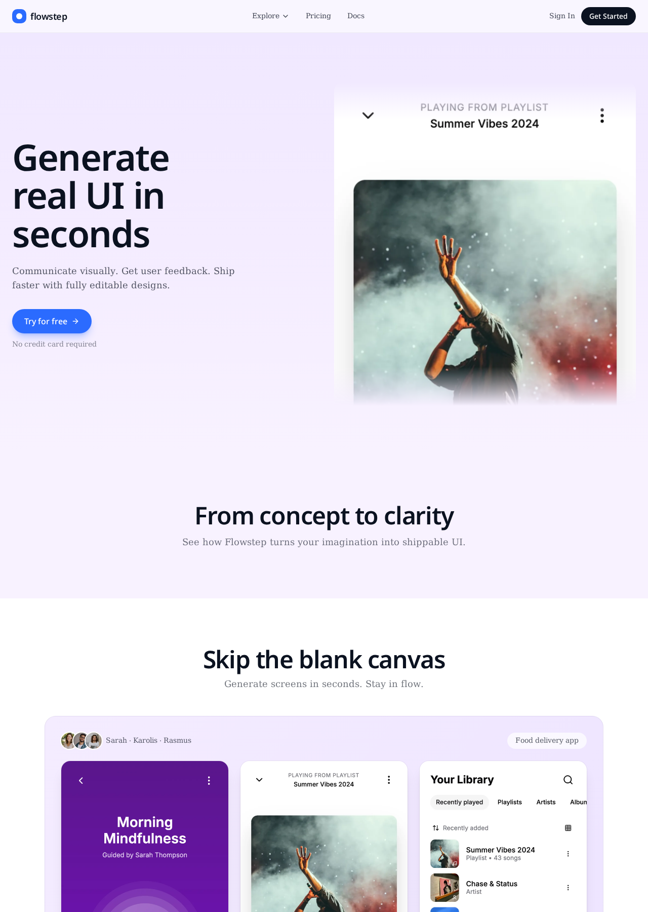
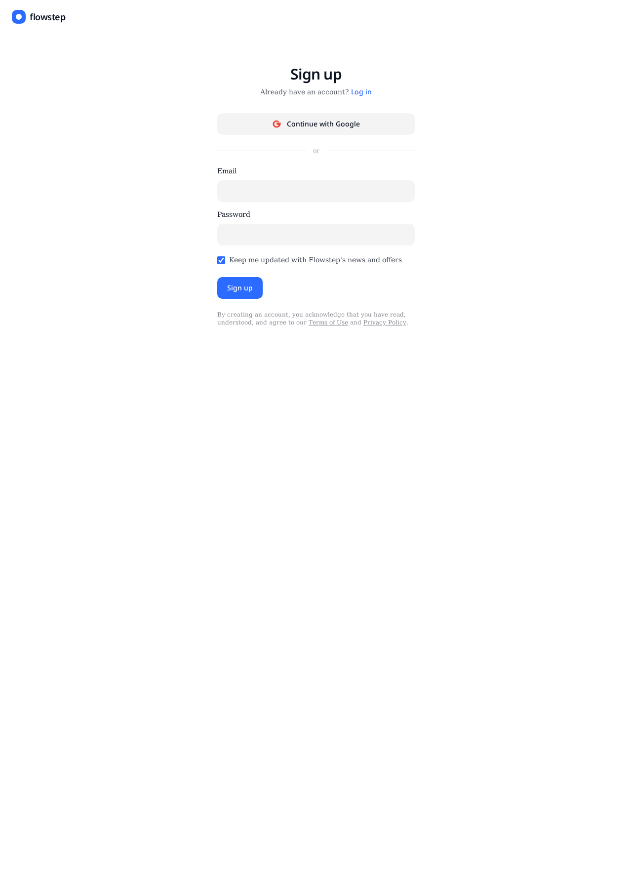

# Flowstep

Generate real, editable UI in seconds. Flowstep turns a text prompt into a live, inspectable design you can tweak, iterate on, and export — no blank canvas required.

## Screenshots

### Landing



### Sign in



## Features

- **Prompt → UI** — describe a screen, get a rendered design in seconds.
- **Inspect & edit** — click any element to tweak copy, styles, or structure with AI assists.
- **Persistent selection** — the selected element stays highlighted across AI edits and re-renders.
- **Reduced-motion aware** — pulse/animation effects respect the user's OS preference.
- **Export** — download a clean, self-contained ZIP with bundled assets.
- **MCP server** — Flowstep exposes an MCP endpoint (`/mcp`) plus a public health check at `/api/public/mcp-health`.

## Tech stack

- [TanStack Start](https://tanstack.com/start) v1 (React 19, SSR, server functions)
- Vite 7 + Tailwind CSS v4
- Lovable Cloud (Postgres, Auth, Storage) via Supabase
- Lovable AI Gateway for model calls
- Cloudflare Workers runtime (edge SSR)

## Getting started

```bash
bun install
bun run dev
```

The app runs at http://localhost:8080.

## Project layout

```
src/
  routes/           file-based routes (TanStack Start)
    __root.tsx      app shell
    index.tsx       landing page
    auth.tsx        sign in / sign up
    _authenticated/ gated app routes
    api/            server routes (webhooks, public APIs)
  components/       UI components (DesignFrame, Inspector, …)
  lib/              client-safe helpers and *.functions.ts server RPCs
  integrations/     Supabase clients + auth middleware
```

## Scripts

| Command | Description |
| --- | --- |
| `bun run dev` | Start the dev server |
| `bun run build` | Production build |
| `bun run lint` | ESLint |
| `bun run format` | Prettier |

## License

Proprietary — all rights reserved.

## Author

Prakash Meena
